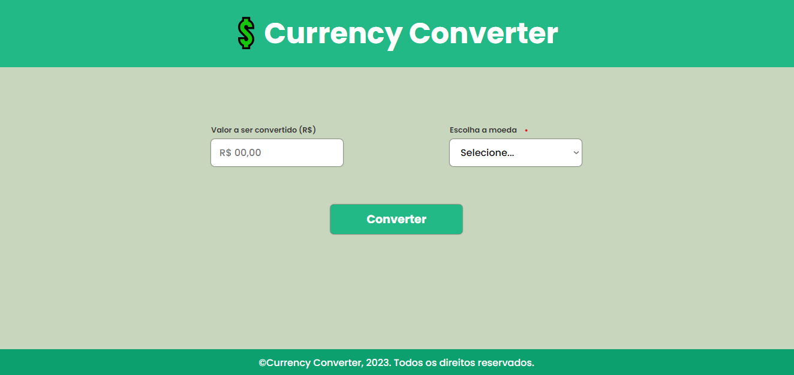

<h1 align="center"> Projeto Currency Converter</h1>

 Esse projeto foi criado durante o curso "HTML5, CSS3 e Javascript na prática" da Udemy. Foram utilizados fundamentos simples de HTMl e CSS e focando na parte de Javascript para ocorrer a conversão de valores pré-declarados das moedas escolhidas e criar uma simples animação quando o resultado do cálculo aparecesse.
 

